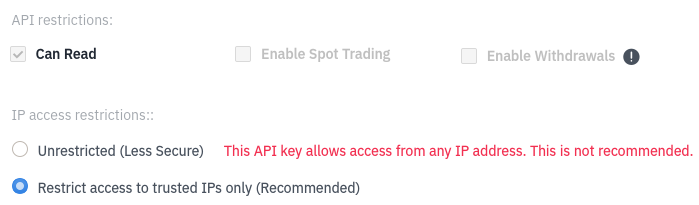

# binance-trades

## Overview

This is a quick GO language based application I put together to download trade history from `binance.us`.

For this to work you need to create API key in your `binance` account.  When application 1st runs it will ask for the key and its secret.  

Provided key and secret will be stored in a secure storage specific to OS you are using.  For details check [library](https://github.com/zalando/go-keyring).

The trades are downloaded to CSV file.

Recommended API Key Configuration:

Make sure to add your machine IP address to the list of trusted IP addresses.

## Usage

By default application runs in interactive mode.  Interactive mode is the best for running application from Windows Explorer, because when application is done it prompts for user input prior to closing the window.

File `result.csv` is generated with Binance trades in it.

To run application in non-interactive mode pass into it `-b` argument on command line.
